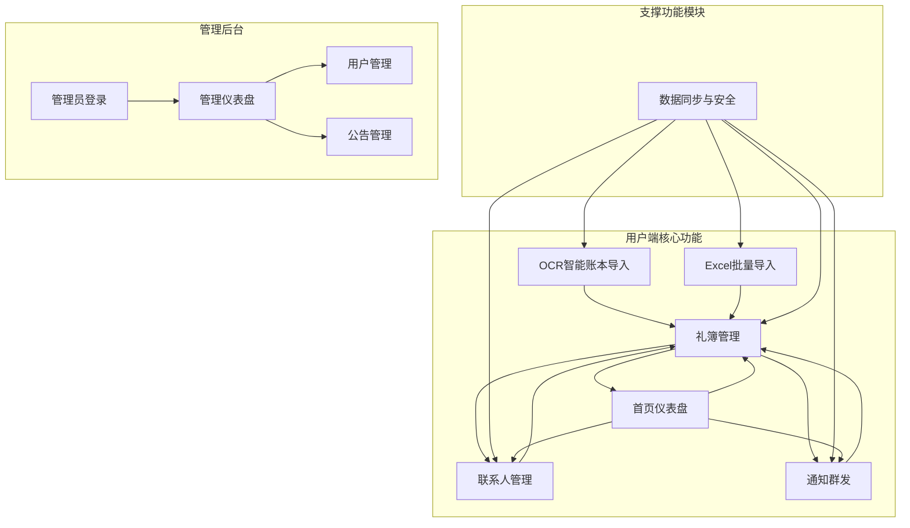
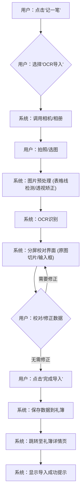
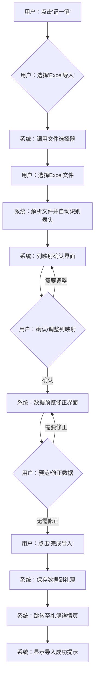
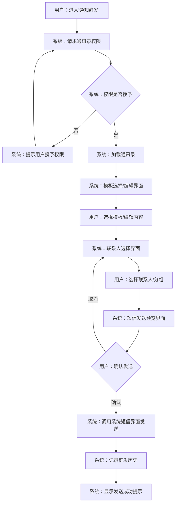

# 心来产品需求文档

## 1. 产品概述

### 1.1 产品名称与定位

*   **产品名称:** 心来 (Xinlai)
*   **产品定位:** 一款专注于人际关系礼金往来管理的移动应用，旨在帮助用户轻松记录、管理和统计各类人情往来，维护和谐的人际关系网络。
*   **产品应用语言:** 简体中文

### 1.2 产品愿景与目标

*   **产品愿景:** 成为用户最信赖的人情往来管理助手，让礼金往来变得简单、透明、有温度，促进人际关系的健康发展。
*   **产品目标:**
    *   提供简单易用的礼金记录工具，降低人情往来管理门槛。
    *   支持多种礼金记录方式，满足不同场景下的记录需求。
    *   实现智能的人情往来统计与提醒功能。
    *   提供便捷的亲友通知功能，简化喜事/白事的信息传达流程。

### 1.3 产品使用终端

*   **主要终端:** 移动端App (iOS & Android)
*   **管理后台:** Web端管理系统 (Web)

### 1.4 核心价值主张

*   **便捷记录:** 提供OCR识别、Excel导入和手动录入等多种方式，帮助用户快速记录礼金往来。
*   **智能统计:** 自动统计收礼/送礼金额，清晰展示人情往来概况。
*   **联系人管理:** 集中管理联系人的往来记录，自动计算人情往来平衡。
*   **通知群发:** 提供喜事/白事模板，便捷地向亲友发送通知信息。
*   **系统管理:** 独立的后台管理系统，用于用户管理和系统公告发布。

### 1.5 目标用户群体分析

*   **新婚夫妇:** 需要记录婚礼礼金往来，管理亲友人情关系。
*   **家庭主妇/主夫:** 负责家庭人情往来管理，需要记录和统计各类礼金支出与收入。
*   **企业行政人员:** 负责公司各类活动的礼金管理，需要高效记录和统计工具。
*   **礼品店/婚庆从业者:** 需要管理客户关系，记录礼金往来信息。
*   **系统管理员:** 负责系统运维、用户管理及发布全员公告。

### 1.6 市场需求与竞品简析

*   **市场需求:** 随着社会交往的频繁，人们对人情往来礼金管理的需求日益增长。传统纸笔记录方式不便管理和统计，而现有记账软件缺乏针对礼金往来的专业功能。
*   **竞品简析:**
    *   **传统记账App:** 如随手记、挖财等，功能全面但缺乏礼金管理专业功能。
    *   **Excel表格:** 灵活但需要手动维护，缺乏统计分析和提醒功能。
    *   **纸质礼金簿:** 传统方式，不便于统计和长期保存，易丢失。
    *   **通用记事本App:** 如印象笔记、有道云笔记等，可记录但缺乏结构化管理和统计功能。
*   **心来优势:** 专注于礼金往来场景，提供OCR识别、Excel导入等便捷记录方式，智能统计分析人情往来，支持喜事/白事通知群发，满足用户在礼金管理方面的全方位需求。

## 2. 功能规格

### 2.1 功能详述

#### 2.1.1 OCR智能账本导入

| 功能ID | 功能名称 | 功能描述 | 优先级 |
|--------|---------|---------|--------|
| F-OCR_001 | 拍照/选图 | 用户可调用系统相机进行拍照，或从相册选择图片。提供裁剪框引导用户对齐表格线，确保识别准确性。 | P0 |
| F-OCR_002 | 图片预处理 | 系统自动进行表格线检测和透视矫正，优化图片质量，提高OCR识别成功率。 | P0 |
| F-OCR_003 | 分屏校对 | 上半部分显示原图切片，并高亮当前正在校对的行；下半部分显示对应的文本输入框，用户可直接修改识别结果。 | P0 |
| F-OCR_004 | 快速修正 | 提供常见姓氏联想功能，在输入姓名时自动弹出联想词。金额输入框旁提供快速选择按钮（200/500/1000/2000），方便用户快速输入。 | P0 |
| F-OCR_005 | 物品记录处理 | 在金额栏旁增加"非礼金"开关。当开关开启时，自动增加"物品描述"输入框，用于记录非礼金类物品。 | P0 |
| F-OCR_006 | 降级方案 | 提供手动框选单行模式，用户可手动选择图片中的单行进行识别。同时提供直接手动录入选项，当OCR识别效果不佳时，用户可完全手动输入数据。 | P0 |

#### 2.1.2 Excel批量导入

| 功能ID | 功能名称 | 功能描述 | 优先级 |
|--------|---------|---------|--------|
| F-EXCEL_001 | 文件格式支持 | 支持导入.xlsx、.xls、.csv格式的Excel文件。 | P0 |
| F-EXCEL_002 | 表头自动识别 | 系统自动识别Excel文件中的表头，如“姓名”、“金额”、“备注”、“日期”等。 | P0 |
| F-EXCEL_003 | 列映射确认 | 用户可查看系统自动识别的列映射关系，并进行手动调整和确认，确保数据导入的准确性。 | P0 |
| F-EXCEL_004 | 数据预览修正 | 提供导入数据的预览功能，用户可在预览界面直接对数据进行批量修正或单条修改。 | P0 |
| F-EXCEL_005 | 导入确认 | 用户确认无误后，点击确认按钮完成数据导入，数据将保存到当前礼簿。 | P0 |

#### 2.1.3 首页仪表盘

| 功能ID | 功能名称 | 功能描述 | 优先级 |
|--------|---------|---------|--------|
| F-HOME_001 | 人情总览 | 显示用户累计收礼金额、累计送礼金额以及当前结余（收礼-送礼），结余金额以红色突出显示。 | P0 |
| F-HOME_002 | 快捷入口 | 提供一个拟物化红包设计的“记一笔”按钮，点击可快速进入新增记录流程。 | P0 |
| F-HOME_003 | 近期动态 | 显示最近5条人情往来记录的快速预览，包括事由、姓名、金额等关键信息。 | P0 |
| F-HOME_004 | 喜庆传统风格UI | 整体UI采用中国红为主色调，金色点缀，背景为淡祥云纹理，并使用传统图标元素，营造喜庆氛围。 | P0 |
| F-HOME_005 | 本月统计 | 在首页总览中增加本月礼金收支统计，显示本月累计收礼和送礼金额，帮助用户掌握近期人情往来情况。 | P0 |

#### 2.1.4 礼簿管理

| 功能ID | 功能名称 | 功能描述 | 优先级 |
|--------|---------|---------|--------|
| F-LEDGER_001 | 礼簿创建 | 用户可创建新的礼簿，创建时需选择礼簿类型（“我办事”或“去随礼”）和具体事由（如婚嫁、满月、乔迁、生日、白事等）。 | P0 |
| F-LEDGER_002 | 白事场景适配 | 当礼簿事由选择为“白事”时，应用界面主色调自动切换为深灰色，去除所有喜庆装饰元素，金额显示改用白底黑字，以符合白事庄重肃穆的氛围。 | P0 |
| F-LEDGER_003 | 礼簿详情 | 点击礼簿列表项进入礼簿详情页，展示该礼簿下的所有往来记录，包括姓名、金额、备注、日期等。 | P0 |
| F-LEDGER_004 | 通知亲友入口 | 在礼簿详情页提供一个“通知亲友”的快捷入口，点击可跳转到通知群发功能，方便用户向亲友发送相关通知。 | P0 |

#### 2.1.5 联系人管理

| 功能ID | 功能名称 | 功能描述 | 优先级 |
|--------|---------|---------|--------|
| F-CONTACT_001 | 往来明细 | 点击联系人列表项进入联系人详情页，显示该联系人的所有往来记录，并汇总累计收礼金额和累计送礼金额。 | P0 |
| F-CONTACT_002 | 拼音排序 | 联系人列表按中文姓名的拼音首字母进行分组和排序，方便用户查找。 | P0 |
| F-CONTACT_003 | 全局搜索 | 提供全局搜索功能，用户可通过输入姓名进行搜索，搜索结果将跨所有礼簿展示同名人员的所有往来记录。 | P0 |

#### 2.1.6 通知群发

| 功能ID | 功能名称 | 功能描述 | 优先级 |
|--------|---------|---------|--------|
| F-NOTIFY_001 | 通讯录读取 | 应用请求读取用户手机通讯录的权限，用于选择短信接收人。 | P0 |
| F-NOTIFY_002 | 模板编辑 | 提供喜事和白事两种预设模板，用户可根据需要选择并进行自定义修改。支持插入变量，如`[姓名]`、`[时间]`、`[地点]`等。 | P0 |
| F-NOTIFY_003 | 联系人选择 | 用户可从手机通讯录中多选联系人，支持按分组（如家人、朋友、同事）进行筛选，方便快速选择。 | P0 |
| F-NOTIFY_004 | 短信发送 | 调用系统短信界面进行发送，确保短信发送的稳定性和合规性。支持分批发送，每批发送人数不超过20人，避免被运营商判定为垃圾短信。 | P0 |
| F-NOTIFY_005 | 群发记录 | 记录所有群发通知的历史，包括发送时间、接收人数、发送内容摘要等，方便用户查阅。 | P0 |

#### 2.1.7 数据同步与安全

| 功能ID | 功能名称 | 功能描述 | 优先级 |
|--------|---------|---------|--------|
| F-SYNC_001 | 用户认证 | 采用手机号+短信验证码的方式进行用户登录和注册，确保用户身份的唯一性和安全性。 | P0 |
| F-SYNC_002 | 增量同步 | 基于数据的`updated_at`时间戳，仅同步本地与云端之间发生变动的数据，减少数据传输量，提高同步效率。 | P0 |
| F-SYNC_003 | 冲突处理 | 当本地数据与云端数据发生冲突时，采用“Last-Write-Wins”策略（即最后修改的数据优先），并保留冲突记录的副本，供用户手动确认和选择。 | P0 |
| F-SYNC_004 | 数据导出 | 支持将礼簿数据或联系人数据导出为Excel文件，并提供通过微信、系统分享等方式发送给他人的功能。 | P0 |
| F-SYNC_005 | 手机号换绑 | 提供手机号换绑功能，用户需先验证原手机号，验证通过后可绑定新手机号，云端数据将自动迁移至新手机号账户下。 | P0 |

#### 2.1.8 前后端联动与页面唯一性规范

| 功能ID | 功能名称 | 功能描述 | 优先级 |
|--------|---------|---------|--------|
| F-LINK_001 | 接口端口统一 | 前端静态预览以 `http://127.0.0.1:5500` 运行，后端接口统一使用 `http://localhost:3030`，所有页面的接口调用必须指向同一端口，确保联动一致性。 | P0 |
| F-LINK_002 | 添加记录页面唯一性 | 所有“添加往来记录”的入口均跳转至唯一页面 `P-ADD_RECORD.html`，页面根据 URL 参数（如 `ledger_id`、`contactName`）执行对应逻辑，避免出现多个实现页面导致数据分流。 | P0 |
| F-LINK_003 | 测试环境数据来源 | 测试阶段前端不再使用任何模拟/虚拟数据，所有展示和操作数据均来自后端真实接口；如需演示，请通过后端脚本生成测试数据。 | P0 |

#### 2.1.9 新增记录提交规范

| 功能ID | 功能名称 | 功能描述 | 优先级 |
|--------|---------|---------|--------|
| F-ADD_001 | 非礼金金额规则 | 当选择“非礼金物品”时，前端提交 `amount=0` 且必须包含 `giftDescription`；普通礼金必须 `amount>0`。 | P0 |
| F-ADD_002 | 提交防重控制 | 保存按钮点击后立即禁用，接口返回成功或失败后恢复；避免重复点击导致的重复记录。建议后端按 `contactName+recordDate+ledgerId+amount` 做幂等校验。 | P0 |

#### 2.1.10 管理后台 (新增)

| 功能ID | 功能名称 | 功能描述 | 优先级 |
|--------|---------|---------|--------|
| F-ADMIN_001 | 管理员登录 | 提供独立的管理员登录界面，使用独立的管理员账号体系（账号/密码）进行登录。 | P0 |
| F-ADMIN_002 | 用户管理 | 展示系统所有注册用户列表，包括用户ID、手机号、注册时间、最后登录时间及礼簿/联系人统计数据。 | P0 |
| F-ADMIN_003 | 公告管理 | 提供系统公告的发布、编辑、删除及激活状态切换功能。支持富文本（或多行文本）内容。 | P0 |
| F-ADMIN_004 | 系统统计 | 仪表盘展示系统核心指标：总用户数、总礼簿数、总记录数、当前活跃公告数。 | P0 |

### 2.2 功能模块间的关系图



## 3. 用户流程

### 3.1 用户旅程地图

| 阶段 | 用户目标 | 用户行为 | 系统响应 | 痛点/机会点 |
|------|----------|----------|----------|-------------|
| **首次使用** | 注册/登录 | 下载App -> 输入手机号 -> 获取验证码 -> 登录 | 发送验证码 -> 验证成功 -> 进入首页 | 注册流程需简洁，验证码接收要快 |
| **创建礼簿** | 记录人情往来 | 点击“记一笔” -> 选择礼簿类型/事由 -> 输入基本信息 -> 保存 | 生成新礼簿 -> 跳转至礼簿详情 | 礼簿类型和事由需丰富，创建流程要直观 |
| **添加记录** | 录入人情数据 | 选择OCR/Excel/手动录入 -> 按指引操作 -> 校对/确认数据 -> 保存 | 识别/导入数据 -> 提供校对界面 -> 保存成功提示 | OCR识别准确率、Excel导入便捷性、手动录入效率 |
| **查看总览** | 了解人情概况 | 进入首页仪表盘 | 展示累计收/送礼、结余、近期动态 | 数据展示需清晰，结余突出 |
| **管理礼簿** | 查找/修改礼簿 | 进入礼簿列表 -> 选择礼簿 -> 查看/编辑详情 | 展示礼簿列表 -> 跳转至礼簿详情 -> 提供编辑/删除功能 | 礼簿查找需便捷，编辑功能要完善 |
| **管理联系人** | 查找/查看联系人往来 | 进入联系人列表 -> 搜索/选择联系人 -> 查看往来明细 | 展示联系人列表 -> 提供搜索结果 -> 跳转至联系人详情 | 联系人查找效率，往来明细清晰展示 |
| **发送通知** | 通知亲友 | 进入通知群发 -> 选择模板 -> 编辑内容 -> 选择联系人 -> 发送 | 提供模板 -> 预览内容 -> 调用系统短信发送 -> 记录发送历史 | 模板多样性，联系人选择便捷性，发送成功率 |
| **系统管理** | 运维管理 | 管理员登录 -> 查看仪表盘 -> 管理用户/发布公告 | 展示统计数据 -> 用户列表 -> 公告CRUD | 管理入口独立，操作权限控制 |

### 3.2 关键路径流程图

#### 3.2.1 OCR智能账本导入流程



#### 3.2.2 Excel批量导入流程



#### 3.2.3 通知群发流程



### 3.3 各场景下的用户操作步骤

#### 3.3.1 场景：用户首次登录并创建礼簿

1.  **用户操作:** 打开心来App。
2.  **系统响应:** 显示登录/注册页（P-LOGIN）。
3.  **用户操作:** 输入手机号，点击“获取验证码”。
4.  **系统响应:** 发送短信验证码，显示验证码输入框。
5.  **用户操作:** 输入验证码，点击“登录/注册”。
6.  **系统响应:** 验证成功，首次登录用户进入首页仪表盘（P-HOME），显示引导创建礼簿的提示。
7.  **用户操作:** 点击首页的“记一笔”按钮。
8.  **系统响应:** 弹出创建礼簿弹窗（P-CREATE_LEDGER）。
9.  **用户操作:** 选择礼簿类型（“我办事”），选择事由（“婚嫁”），输入礼簿名称（如“我的婚礼”），点击“创建”。
10. **系统响应:** 创建成功，跳转至礼簿详情页（P-LEDGER_DETAIL），并提示用户添加记录。

#### 3.3.2 场景：用户通过OCR导入账本记录

1.  **用户操作:** 在礼簿详情页（P-LEDGER_DETAIL）点击“添加记录”按钮。
2.  **系统响应:** 弹出添加记录方式选择弹窗。
3.  **用户操作:** 选择“OCR智能导入”。
4.  **系统响应:** 跳转至OCR拍照/选图页（P-OCR_IMPORT），调用相机或相册。
5.  **用户操作:** 拍照或选择包含账本表格的图片，系统自动进行裁剪框引导。
6.  **系统响应:** 系统进行图片预处理和OCR识别，然后跳转至OCR校对页（P-OCR_PROOFREAD）。
7.  **用户操作:** 在分屏校对界面，上半部分查看原图切片并高亮当前行，下半部分在输入框中修正识别结果。对于金额，可点击快速选择按钮（200/500/1000/2000）。对于非礼金物品，开启“非礼金”开关并输入物品描述。
8.  **系统响应:** 实时更新校对结果。
9.  **用户操作:** 完成所有行的校对后，点击“完成导入”按钮。
10. **系统响应:** 数据保存到当前礼簿，跳转回礼簿详情页（P-LEDGER_DETAIL），并显示导入成功提示。

#### 3.3.3 场景：用户发送婚礼通知短信

1.  **用户操作:** 在礼簿详情页（P-LEDGER_DETAIL）点击“通知亲友”按钮。
2.  **系统响应:** 跳转至通知群发页（P-NOTIFY_MASS），并请求通讯录权限。
3.  **用户操作:** 授予通讯录权限。
4.  **系统响应:** 加载通讯录，并显示模板选择/编辑界面。
5.  **用户操作:** 选择“喜事模板”，编辑短信内容，插入`[姓名]`、`[时间]`、`[地点]`等变量。
6.  **系统响应:** 实时预览短信内容。
7.  **用户操作:** 点击“选择联系人”按钮。
8.  **系统响应:** 跳转至联系人选择页（P-CONTACT_SELECT），显示手机通讯录列表。
9.  **用户操作:** 勾选需要发送通知的联系人，可使用分组筛选功能。
10. **系统响应:** 勾选后返回通知群发页（P-NOTIFY_MASS），显示已选择的联系人数量。
11. **用户操作:** 点击“发送”按钮。
12. **系统响应:** 调用系统短信界面，将短信内容和联系人列表传递过去，用户在系统界面确认发送。
13. **系统响应:** 发送成功后，记录群发历史，并显示发送成功提示。

#### 3.3.4 场景：管理员管理系统 (新增)

1.  **管理员操作:** 访问管理员登录页 (`P-ADMIN_LOGIN.html`)。
2.  **系统响应:** 显示用户名/密码输入框。
3.  **管理员操作:** 输入账号密码，点击登录。
4.  **系统响应:** 验证通过，跳转至管理仪表盘 (`P-ADMIN_DASHBOARD.html`)。
5.  **管理员操作:** 点击“公告管理”标签页，点击“发布公告”。
6.  **系统响应:** 弹出公告编辑弹窗。
7.  **管理员操作:** 输入标题、内容，选择是否立即激活，点击保存。
8.  **系统响应:** 保存成功，列表刷新显示新公告。

## 4. 数据流设计

### 4.1 数据结构与关系

*   **用户 (User):**
    *   `user_id` (PK)
    *   `phone_number` (Unique)
    *   `registration_date`
    *   `last_login_date`
*   **礼簿 (Ledger):**
    *   `ledger_id` (PK)
    *   `user_id` (FK to User)
    *   `ledger_name`
    *   `ledger_type` (e.g., '我办事', '去随礼')
    *   `occasion` (e.g., '婚嫁', '满月', '白事')
    *   `creation_date`
    *   `last_update_date`
*   **记录 (Record):**
    *   `record_id` (PK)
    *   `ledger_id` (FK to Ledger)
    *   `contact_name`
    *   `amount` (礼金金额)
    *   `is_gift_item` (Boolean, 是否为物品)
    *   `gift_description` (物品描述)
    *   `note` (备注)
    *   `record_date` (记录发生日期)
    *   `creation_date`
    *   `last_update_date`
*   **联系人 (Contact):** (与Record中的contact_name关联，用于聚合统计)
    *   `contact_id` (PK)
    *   `user_id` (FK to User)
    *   `contact_name`
    *   `phone_number` (Optional)
    *   `total_received` (累计收礼)
    *   `total_given` (累计送礼)
    *   `last_contact_date`
*   **通知模板 (NotificationTemplate):**
    *   `template_id` (PK)
    *   `template_name`
    *   `template_content` (包含变量)
    *   `template_type` (e.g., '喜事', '白事')
*   **群发记录 (MassSendLog):**
    *   `log_id` (PK)
    *   `user_id` (FK to User)
    *   `ledger_id` (FK to Ledger, Optional)
    *   `send_time`
    *   `recipient_count`
    *   `message_content_summary`
    *   `status` (e.g., '成功', '失败')
*   **管理员 (AdminUser) (新增):**
    *   `id` (PK)
    *   `username` (Unique)
    *   `password` (Hashed)
*   **系统公告 (SystemAnnouncement) (新增):**
    *   `id` (PK)
    *   `title`
    *   `content`
    *   `is_active`
    *   `created_at`
    *   `updated_at`

### 4.2 关键数据流向图

```mermaid
graph TD
    subgraph "用户操作层"
        A["用户输入/操作"]
    end

    subgraph "应用逻辑层"
        B["数据采集/处理"]
        C["业务逻辑处理"]
        D["数据同步/存储"]
    end

    subgraph "数据存储层"
